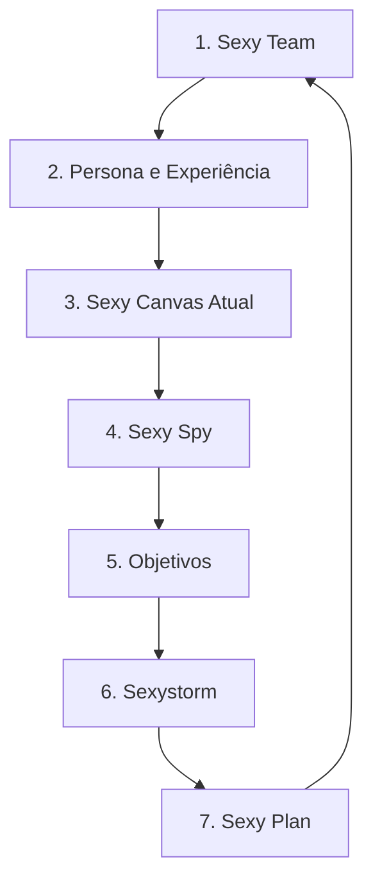

# Manual de Implementação do Sexy Canvas

O **Sexy Canvas** é uma metodologia que visa mapear e aplicar elementos de desejo, sensações e sentimentos humanos (baseados em 14 itens específicos) a produtos, serviços e marcas para torná-los altamente atraentes e engajadores. Este manual descreve o processo de implementação estruturado em 7 etapas.

---

## Fluxo de Implementação

---

## Detalhamento das Etapas

### 1. Sexy Team
Monte uma equipe de mentes abertas e ousadas. Traga para este momento todas as informações e conhecimentos sobre seu público. É essencial ter em sua equipe:
*   **Especialista na metodologia:** Um profissional que domine o Sexy Canvas.
*   **Poder de decisão (C-Level):** Essencial para a construção do Sexy Canvas global da empresa.
*   **Especialistas de áreas/departamentos:** Necessários para a construção de Canvas focados em personas ou experiências específicas.

### 2. Persona e Experiência
Defina as personas que serão analisadas e as experiências envolvidas. 
*   Use um canvas específico para cada persona e experiência.
*   Comece pelo **Sexy Canvas Global** da empresa/projeto.
*   Considere inicialmente a persona "clientes" e a experiência "interagir com a marca".
*   Anote ideias de novas personas e experiências que podem ser geradas de acordo com seus objetivos.

### 3. Sexy Canvas Atual
Construa o Sexy Canvas atual da persona e experiência definida, considerando unicamente a realidade do momento.
*   Liste pontos fortes e fraquezas.
*   Ambos os aspectos serão fundamentais para a geração de novas ideias na etapa de brainstorming.

### 4. Sexy Spy
Faça o Sexy Canvas de seus principais concorrentes e referências do mercado.
*   Observe as principais diferenças entre os Canvas dos concorrentes e o seu.
*   Identifique lacunas (*gaps*) e oportunidades de diferenciação.

### 5. Objetivos
Defina os principais objetivos de negócio e produto para este trabalho. Exemplos:
*   Aumentar faturamento.
*   Reter clientes (LTV).
*   Melhorar o engajamento.
*   Construir um novo modelo de negócio.

### 6. Sexystorm
Percorra cada um dos 14 itens do Sexy Canvas, levantando ideias para "eletrificar" sua persona. Anote cada ideia em um post-it sem julgamentos prévios. Utilize os diferenciais dos concorrentes e os gaps identificados.

**Diretrizes para o Sexystorm:**
1.  **Melhore os itens negativos** do seu canvas atual.
2.  **Observe seus concorrentes** para extrair melhorias para o seu produto.
3.  **Melhore os itens positivos** que você já possui.
4.  **Pense fora da caixa** o máximo possível (#semcensura).

### 7. Sexy Plan
Selecione as melhores ideias geradas e distribua-as no diagrama **Esforço x Sexy**, considerando:
*   O esforço de tempo e dinheiro necessário.
*   O nível de "eletrização" (impacto emocional/atratividade) da ideia.
*   Escolha as ideias a serem executadas e preencha o plano de ação com responsáveis e prazos claros. Execute e avalie os resultados continuamente.