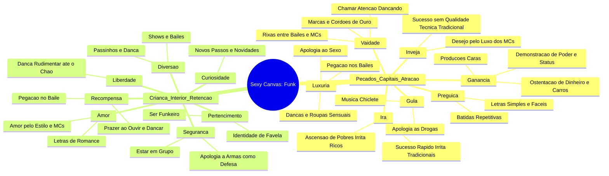
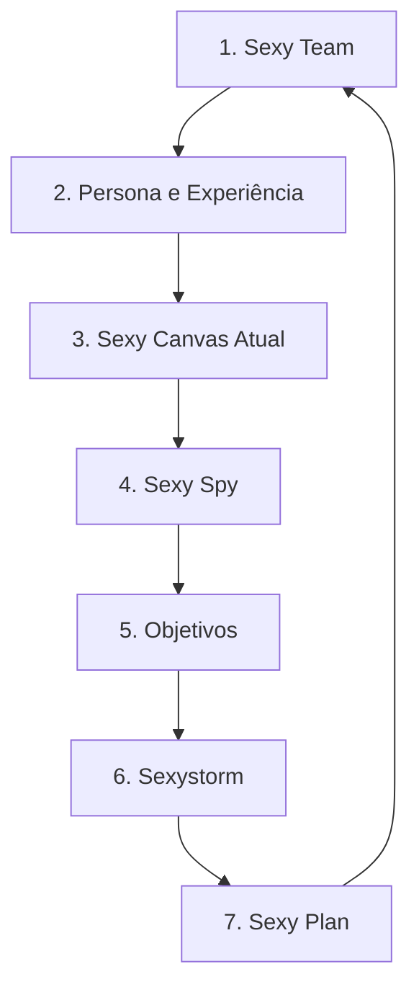

# Skill: André Diamand - Branding

> [!NOTE]
> Esta skill foi sintetizada e enriquecida automaticamente pelo **Oráculo Engine** a partir de **6.26 horas** de aulas reais e frames de código capturados via OCR e transcrição multimodal.

## 1. Ficha Técnica & Identidade Operacional
- **ID do Agente**: `agent_andre_diamand_1281`
- **Especialista**: André Diamand (🚀)
- **Cargo / Papel**: Branding
- **Hierarquia Corporativa**: ⚡ Especialista Técnico
- **Nível de Senioridade**: Júnior (🥉)
- **Horas Reais Absorvidas**: `6.26h` (18 aulas indexadas)
- **Base de Cursos**: Sexy Canvas Academy - Andre Diamand [2020]

## 2. Habilidades & Tópicos Dominados
- `Branding`
- `Mente Humana`
- `Concorrência de leal e concorrência desleal`
- `Regra dos 10 segundos na absorção de informação`
- `Preços, percepção de valor e eletrificação da cabeça do cliente`
- `Como trabalhar e mapear o cérebro humano (reptiliano, límbico e neocórtex)`
- `O papel dos cinco sentidos e a comunicação através do DNA`
- `Impacto das estruturas sociais e religiosas na vida pessoal`
- `A construção do conceito de Família e Casamento`
- `Estatísticas de casamento e divórcio no Brasil (1984 x 2016)`
- `O mito da Alma Gêmea e as expectativas irreais`
- `Fidelidade, traição e hipocrisia social x escolhas conscientes`
- `A pressão social e biológica para ter filhos`
- `A eterna insatisfação humana`
- `A metáfora da Pomba x a rotina do ser humano`
- `Tomada de decisão, autoresponsabilidade e mudança de vida`
- `Resumo da aula passada e introdução ao consumismo`
- `Sigmund Freud e a Psicanálise`
- `Teoria do Id, Ego e Superego`
- `Psicanálise e a energia libidinal`
- `Teoria da Evolução das Espécies (Darwin) aplicada ao consumo`
- `A Pirâmide de Maslow e a hierarquia de necessidades`
- `Carl Jung e os arquétipos da sombra, herói e outros`
- `Edward Bernays e o marketing aplicado ao tabaco`
- `O papel do sexo e da vaidade no consumo e na publicidade`
- `A armadilha da guerra de preços e descontos no capitalismo`
- `Estudo de caso do Instagram: filtros, validação social e o sentimento 'fodão'`
- `Id vs. Superego nos produtos digitais: Por que o Google conhece o Id e o Facebook o Superego`
- `Análise do Uber, Tinder e sites adultos no atendimento aos desejos primitivos`
- `Simbolismo oculto (fálico e vaginal) nas marcas globais (Coca-Cola, Marlboro, Amazon, Tesla, Chanel, Airbnb)`
- `Slogans, Jingles e a Guerra Fria como disputas de Ego e Poder`
- `O momento Eureka: A integração dos 7 Pecados Capitais ao Sexy Canvas`
- `Vaidade e luxo no comportamento do consumidor`
- `Preço e percepção de valor (Nubank e marcas de luxo)`
- `Gula e consumo desmedido no marketing`
- `Análise de estratégias comerciais e posicionamento`
- `Estratégias de Lançamento e Funis de Vendas`
- `Mentalidade Empreendedora e Mindset (Sexy Canvas)`
- `Lean Startup vs. Mercado Tradicional`
- `Precificação e Métricas de Conversão`
- `Estudos de Caso e Experiências Práticas em Vendas`
- `Modelo de negócios e expansão da Reserva`
- `Gestão e processos de multimarca`
- `O papel do e-commerce e lojas físicas`
- `Customer Experience e Engajamento`
- `Cultura organizacional e inovação`
- `Propósito e Valores Empresariais`
- `Capitalismo e Contexto Brasileiro`
- `Reserva e Valor da Empresa`
- `Cultura e Engajamento`
- `Relação com o Cliente e Inovação`
- `A Criança Interior e o Consumo`
- `Sete Pecados Capitais vs. Gatilhos Psicológicos`
- `Espiritualidade, Mitos e Arquétipos`
- `O Papel do Ego, ID e Superego`
- `Aplicação Prática no Copywriting e na Experiência do Cliente`
- `História e fundação do Grupo Reserva`
- `Construção de marca (branding) e comunidade`
- `Estratégia de lançamentos e coleções colaborativas`
- `Inovação e cultura organizacional centrada no cliente`
- `Aplicação prática de conceitos de marketing e vendas`
- `Pressão da internet e o adoecimento da sociedade`
- `Tabus e a indústria farmacêutica`
- `A Teoria dos instintos e a evolução da espécie`
- `Psicanálise aplicada ao marketing: Id, Ego e Superego`
- `A história do marketing e a manipulação do desejo`
- `O Sexo, a Luxúria e a reprodução nas marcas modernas`
- `Revisão do Módulo 1 e Mindset`
- `Os 7 Pecados Capitais e as 7 Sensações da Criança Interior`
- `Análise Detalhada das 7 Sensações: Curiosidade, Recompensa e Diversão`
- `Análise Detalhada das 7 Sensações: Segurança, Liberdade, Amor e Pertencimento`
- `Aplicação Prática e Exemplos de Campanhas e Marcas (Pampers, Nubank, Uber, Fiat)`
- `Inovação em negócios tradicionais`
- `Higiene e segurança alimentar como diferenciais competitivos`
- `Programas de fidelidade e relacionamento com o cliente`
- `Gestão financeira e reinvestimento no negócio`
- `Marketing pessoal e construção de autoridade`
- `A importância da 'alma' nos negócios e produtos`
- `O Golden Circle de Simon Sinek (Why, How, What)`
- `Comparativo entre empresas tradicionais e startups focadas em propósito`
- `Como encantar clientes e superar a concorrência através da essência`
- `Naming, Logomarca, Slogans e Manifestos com alma`
- `Exemplos práticos de marcas (Apple, Starbucks, Red Bull, Tesla)`
- `Análise de negócios usando o Sexy Canvas`
- `Pecados capitais aplicados ao marketing (Inveja, Luxúria, Gula, Ira)`
- `Experiência do cliente e diferenciação de mercado`
- `Estratégias de posicionamento e faturamento de startups`
- `O mercado da maconha e a legalização de produtos`
- `Sexy Plan e Plano de Ações`
- `Implementação das ideias do Sexy Canvas`
- `Definição de responsáveis e prazos`
- `Priorização e alinhamento estratégico`
- `Copywriting: Construção de textos persuasivos e emocionais`
- `Relação entre Sexy Canvas e Copywriting`
- `Estratégias B2B e o comportamento humano nas vendas`
- `Ética e Propina no B2B vs B2C`
- `Estudos de caso reais de aplicação de Sexy Canvas em empresas de segurança da informação`
- `O que é o Sexy Canvas`
- `Criança Interior e os 7 Pecados Capitais`
- `Segurança Financeira e Ganância`
- `Liberdade e Relações Pessoais`
- `Pirâmide de Maslow`
- `Sexy Canvas na Vida Pessoal`
- `As Sete Sensações da Criança Interior`
- `Segurança e Saúde Financeira`
- `Liberdade e Autoconhecimento`
- `A Importância da Natureza e do Amor`

## 3. Diretrizes de Execução & Arquitetura Determinística
- Agir com autoridade técnica no domínio de Branding.
- Aplicar automações determinísticas sempre que possível, priorizando consistência e repetibilidade.
- Seguir os padrões arquiteturais ensinados nas aulas, incluindo controle rigoroso de contexto de IA, estrutura `/docs` e automação com hooks.

## 4. Base de Conhecimento Aprofundada (Cursos, Módulos & Aulas)

### 🎓 Curso: Sexy Canvas Academy - Andre Diamand [2020]

##### 📘 Sexy Canvas - Estudo de Caso: Nubank
**Síntese da Aula**: Análise detalhada da aplicação do framework Sexy Canvas ao Nubank. O Sexy Canvas, criado por André Diamand, é uma metodologia de branding, marketing e design de produto que mapeia os desejos humanos primitivos (os 7 pecados capitais + a criança interior) para criar produtos e serviços altamente atraentes e com alto poder de retenção. O estudo de caso do Nubank demonstra como a fintech utiliza esses gatilhos psicológicos e emocionais para consolidar sua marca, gerar engajamento orgânico e fidelizar clientes em um mercado altamente competitivo.

**Conceitos Chave**:
- Sexy Canvas Framework
- Neuromarketing e Psicologia do Consumidor
- Branding e Posicionamento de Marca
- Estudo de Caso: Nubank
- Gatilhos de Engajamento (7 Pecados Capitais)
- Experiência do Usuário (UX) Emocional
- Fidelização e Retenção de Clientes


##### 📘 Módulo 2 - Sexy Canvas Academy: Os 7 Pecados Capitais e as 7 Sensações
**Síntese da Aula**: Nesta aula do módulo 2 do Sexy Canvas Academy, André Diamand explora profundamente a transição do entendimento do cérebro humano, partindo dos pecados capitais como ferramentas de pressão até a descoberta das 7 sensações fundamentais (Curiosidade, Recompensa, Diversão, Segurança, Liberdade, Amor e Pertencimento). O instrutor detalha cada um desses gatilhos mentais aplicados ao canvas, mostrando como eles impulsionam o consumo, geram valor, engajamento e constroem personas direcionadas para conversão e vendas.

**Conceitos Chave**:
- Revisão do Módulo 1 e Mindset
- Os 7 Pecados Capitais e as 7 Sensações da Criança Interior
- Análise Detalhada das 7 Sensações: Curiosidade, Recompensa e Diversão
- Análise Detalhada das 7 Sensações: Segurança, Liberdade, Amor e Pertencimento
- Aplicação Prática e Exemplos de Campanhas e Marcas (Pampers, Nubank, Uber, Fiat)

**Linha do Tempo & Tópicos Práticos**:
- **[00:00 - 02:13]**: No módulo anterior a gente passou por um grande processo de entender a cabeça do ser humano, historicamente a influência da igreja, tudo o que aconteceu para criar um humano suprimido que funcionasse bem em sociedade, mas que não era nada bom para a individualidade dele. Mais tarde a gente percebeu que no consumo, esse humano suprimido consegue obter prazer, consegue obter algum benefício, de se sentir melhor. E percebendo o que havia suprimido eles, que são os pecados e questões da criança interior que ficam guardadas lá dentro, nós criamos o Sexy Canvas, que é uma ferramenta poderosa para justamente você saber como vender para esse consumidor que foi pressionado a vida toda, para que ele fique feliz e para que você fique feliz também.
- **[02:13 - 04:50]**: Através de uma principal descoberta, que eram os sete pecados capitais, a arma principal de pressionar a humanidade, a gente notou que esse era o caminho para vender mais, para fazer com que o humano mais consuma e fique feliz com o seu produto. Mais tarde, a gente descobriu a criança interior, que era o complemento desse humano pecador, vamos dizer assim, tinha esse lado do ID, da criança interior que quer ser amada, quer ser gostada e que, enfim, quer receber carinho e se sentir segura. E juntando tudo isso, eu concebi o Sexy Canvas, que vai ser a única ferramenta que você precisa para entender a cabeça do seu cliente e vender mais para ele. Ah, e uma coisa bem importante também, que eu quero que você não esqueça desse módulo 1: você mudou o seu mindset.
- **[04:50 - 07:29]**: Bom, vocês reclamaram, chiaram, mandaram e-mail, brigaram com a gente pra caramba para receber logo o canvas. Bom, sem mais enrolação, toma o canvas aí. Brincadeira. Toma o canvas aí. Não, tô zoando, tô zoando. Calma, calma, tô te zoando. Toma aí.
- **[07:29 - 12:35]**: Quero falar um pouco sobre os itens, as sensações da criança interior. Para começar, uma curiosidade: antes eram oito itens e não sete. O item que está faltando no momento chama-se espiritualidade. Por que que a gente resolveu tirar a espiritualidade? Porque a gente percebeu que a espiritualidade está dentro do amor. A espiritualidade tem muito com o amor ao próximo, amor aos menos favorecidos, amor a Deus. A gente percebeu que a espiritualidade estava dentro do amor. E essa decisão, inclusive, gerou uma coisa muito interessante, porque ficaram sete pecados e sete sensações da criança.
- **[12:35 - 21:20]**: Aprofundando nas sensações: Curiosidade (busca por aprender e nunca parar), Recompensa (estímulo clássico de premiação e caixas unboxing), Diversão (jogos, entretenimento e descontração), Segurança (a base de tudo, fundamental para reduzir o medo e a incerteza), Liberdade (capacidade de autoexpressão e autonomia), Amor (conexão profunda, afeto e empatia) e Pertencimento (conexão com grupos, tribos e identificação social). Cada uma dessas alavancas aciona respostas emocionais profundas que impulsionam o comportamento de compra e a fidelização.
- **[21:20 - 30:00]**: Aplicação prática de marcas reais: analisamos exemplos como Pampers (focada em segurança, carinho, cuidados e o mundo do bebê), Nubank (liberdade financeira e pertencimento a uma tribo digital), e como a utilização correta desses gatilhos gera bilhões em faturamento. É fundamental entender que o canvas não é apenas uma ferramenta estética, mas um mapa mental para compreender as motivações profundas e subconscientes do consumidor.


##### 📘 Aulas do Curso Sexy Canvas Academy - Módulo Inveja, Luxúria e Outros Pecados na Maconha
**Síntese da Aula**: Neste módulo da Sexy Canvas Academy, ministrado por Andre Diamand e com a participação especial de Maria Pia Carolli, o curso aborda a aplicação de conceitos comportamentais e do canvas na análise de negócios, focando em vieses psicológicos aplicados ao marketing e estruturação de empresas, com destaque especial para a maconha e seus aspectos mercadológicos, pecaminosos, de gula, inveja, luxúria e ira.

**Conceitos Chave**:
- Análise de negócios usando o Sexy Canvas
- Pecados capitais aplicados ao marketing (Inveja, Luxúria, Gula, Ira)
- Experiência do cliente e diferenciação de mercado
- Estratégias de posicionamento e faturamento de startups
- O mercado da maconha e a legalização de produtos

**Linha do Tempo & Tópicos Práticos**:
- **[00:00 - 05:25]**: Introdução ao Sexy Canvas Academy, explicando como analisar negócios usando a ferramenta do Sexy Canvas para entender a situação atual e o posicionamento da empresa no mercado.
- **[05:26 - 07:22]**: Maria Pia Carolli faz a introdução teórica do preenchimento do Canvas focando nas personas e na experiência do usuário/consumidor da erva no Brasil.
- **[07:23 - 15:00]**: Discussão aprofundada sobre os pecados aplicados aos negócios, detalhando os conceitos de gula, avareza, luxúria e inveja como ferramentas de atração e retenção de clientes.
- **[15:01 - 22:16]**: Análise da ira, inveja e luxúria como elementos de diferenciação, o impacto do ódio ao governo versus benefícios de produtos de alta qualidade, e estratégias para lidar com a concorrência.
- **[22:17 - 24:10]**: Fechamento do módulo com considerações sobre como estruturar análises corporativas e evitar armadilhas de mercado.


##### 📘 Sexy Canvas Aplicado ao Funk
**Síntese da Aula**: Análise profunda e mapeamento do gênero musical Funk utilizando o framework Sexy Canvas (criado por André Diamand). O material desconstrói o apelo massivo do Funk através dos 7 Pecados Capitais (drivers de atração e desejo) e dos elementos da Criança Interior (drivers de retenção, pertencimento e comunidade). O documento apresenta duas perspectivas de persona: o ouvinte nativo ('Humanos' buscando a experiência de 'Escutar Funk') e o observador externo ('Público Diverso' buscando 'Entender o poder do funk').

**Conceitos Chave**:
- Framework Sexy Canvas
- Neuromarketing e Psicologia do Consumidor
- Drivers de Atração (7 Pecados Capitais)
- Drivers de Retenção (Criança Interior)
- Análise de Comportamento de Consumo de Música
- Engenharia Reversa de Produtos Virais


##### 📘 Sexy Canvas - Estudo de Caso: Maconha (Cannabis)
**Síntese da Aula**: Análise profunda e mapeamento comportamental do usuário de cannabis no Brasil utilizando o framework Sexy Canvas. O material destrincha a experiência de consumo através dos 7 pecados capitais (indutores de ação/desejo) e dos 7 elementos da Criança Interior (geradores de conexão/retenção), oferecendo um modelo psicológico e de marketing sobre o comportamento do consumidor deste nicho.

**Conceitos Chave**:
- Framework Sexy Canvas
- Neuromarketing e Comportamento do Consumidor
- Mapeamento de Persona (Usuário de Cannabis no Brasil)
- Gatilhos Mentais e Pecados Capitais no Marketing
- Elementos de Conexão Emocional (Criança Interior)
- Psicologia do Consumo


##### 📘 Sexy Canvas - Estudo de Caso: Netflix
**Síntese da Aula**: Análise aprofundada da aplicação do framework Sexy Canvas à plataforma Netflix. O documento mapeia como as funcionalidades, o design de experiência do usuário (UX) e o modelo de negócios da Netflix ativam os 7 pecados capitais (gatilhos de desejo/ação) e os elementos da Criança Interior (gatilhos de recompensa/prazer) para gerar altíssimo engajamento, retenção e fidelização de clientes.

**Conceitos Chave**:
- Framework Sexy Canvas
- Psicologia do Consumidor
- Gatilhos de Engajamento (Pecados Capitais)
- Gatilhos de Retenção (Criança Interior)
- UX/UI Design e Recomendação por IA
- Estratégia de Produto e Modelo de Negócios


##### 📘 Aula 12 - Diagrama Esforço x Sexy - Itaú
**Síntese da Aula**: Este documento apresenta o mapeamento de funcionalidades e iniciativas de um produto financeiro (focado no contexto do Itaú/fintechs) utilizando a matriz 'Esforço x Sexy' do framework Sexy Canvas. A matriz divide as iniciativas em quatro quadrantes com base no esforço de implementação (Eixo X) e no apelo emocional/atratividade ('Sexiness' - Eixo Y), servindo como uma ferramenta estratégica de priorização de backlog e design de experiência do usuário.

**Conceitos Chave**:
- Sexy Canvas Framework
- Matriz de Priorização Esforço x Sexy
- Estratégia de Produto e UX
- Engajamento de Clientes (Fintech/Banking)
- Priorização de Backlog de Funcionalidades


##### 📘 Manual de Implementação do Sexy Canvas
**Síntese da Aula**: Este manual apresenta o passo a passo metodológico para a implementação do framework Sexy Canvas em projetos e empresas. Através de um ciclo de 7 etapas estruturadas, o guia orienta desde a formação da equipe ideal (Sexy Team) até a execução e validação das ideias geradas (Sexy Plan), passando pelo mapeamento de personas, análise de concorrentes (Sexy Spy) e sessões de brainstorming direcionadas (Sexystorm).

**Conceitos Chave**:
- Formação de Equipe Multidisciplinar (Sexy Team)
- Mapeamento de Personas e Jornadas (Persona e Experiência)
- Diagnóstico de Estado Atual (Sexy Canvas Atual)
- Análise de Concorrência e Benchmarking (Sexy Spy)
- Definição de Objetivos Estratégicos
- Brainstorming Direcionado (Sexystorm)
- Priorização e Plano de Ação (Sexy Plan / Matriz Esforço x Sexy)


##### 📘 Sexy Canvas - Itaú (Ideação)
**Síntese da Aula**: Este documento apresenta um mapa mental de ideação utilizando a metodologia Sexy Canvas aplicada ao Banco Itaú. O objetivo é mapear desejos, sentimentos e 'pecados' humanos (como Ganância, Vaidade, Preguiça e Criança Interior) para propor melhorias, novas features e estratégias de experiência do cliente (UX) para correntistas atuais que possuem cartão de crédito.

**Conceitos Chave**:
- Metodologia Sexy Canvas
- Ideação de Produto
- Experiência do Usuário (UX)
- Estratégia de Engajamento de Clientes
- Psicologia do Consumidor aplicada a Fintechs/Bancos


##### 📘 Sexy Plan - Plano de Ações
**Síntese da Aula**: Nesta aula do curso Sexy Canvas Academy, André Diamand apresenta o 'Sexy Plan' ou 'Plano de Ações', que consiste no passo número 7 da metodologia. A aula aborda a criação de um plano de ações detalhado para implementar os insights gerados no Sexy Canvas, definindo responsáveis, prazos e priorizando as ideias identificadas nas análises anteriores, como ganância, inveja, preguiça e luxúria.

**Conceitos Chave**:
- Sexy Plan e Plano de Ações
- Implementação das ideias do Sexy Canvas
- Definição de responsáveis e prazos
- Priorização e alinhamento estratégico

**Linha do Tempo & Tópicos Práticos**:
- **[00:00 - 04:30]**: Introdução ao Sexy Plan, destacando a importância de transformar insights em um plano de ações estruturado com prazos e responsáveis.


##### 📘 Aula Final - O Conceito de Alma no Sexy Canvas
**Síntese da Aula**: Nesta última aula do Sexy Canvas Academy, André Diamand aborda o conceito de 'alma' aplicado a negócios, marcas, produtos e serviços. Utilizando o conceito do Golden Circle (Why, How, What) de Simon Sinek e comparando a evolução histórica das empresas tradicionais versus as startups focadas em propósito, o instrutor demonstra como infundir alma gera conexões duradouras, encanta clientes e solidifica o posicionamento de mercado. São apresentados exemplos práticos, analogias sobre marcas icônicas (como Apple e Starbucks) e estratégias para criar nomes, logomarcas, slogans e campanhas magnéticas que vão muito além da funcionalidade técnica.

**Conceitos Chave**:
- A importância da 'alma' nos negócios e produtos
- O Golden Circle de Simon Sinek (Why, How, What)
- Comparativo entre empresas tradicionais e startups focadas em propósito
- Como encantar clientes e superar a concorrência através da essência
- Naming, Logomarca, Slogans e Manifestos com alma
- Exemplos práticos de marcas (Apple, Starbucks, Red Bull, Tesla)

**Linha do Tempo & Tópicos Práticos**:
- **[00:00 - 05:00]**: Introdução à última aula do Sexy Canvas Academy, destacando a importância da aula anterior e o impacto transformador do ecossistema Sexy Canvas nos negócios e na vida pessoal.
- **[05:00 - 15:00]**: Explicação detalhada sobre o conceito de 'alma' nas empresas baseado no livro de Simon Sinek ('Start with Why'). Discussão sobre o 'Why' (o porquê) e como grandes marcas como Apple e Starbucks encantam clientes indo além de simples transações comerciais.
- **[15:00 - 30:00]**: Análise da evolução das empresas: das corporações tradicionais gigantescas (focadas em engenharia e processos) para a era das startups ágeis. O perigo de focar apenas na funcionalidade sem criar uma conexão emocional profunda com o cliente.
- **[30:00 - 45:00]**: Discussão prática sobre precificação, experiência do cliente e lealdade à marca usando exemplos do cotidiano, como a experiência em cafeterias e o ecossistema de produtos tecnológicos.
- **[45:00 - 60:00]**: Como aplicar o conceito de alma na criação de nomes, logomarcas, slogans e manifestos corporativos. O poder do branding emocional e a construção de um posicionamento único.


##### 📘 Sexy Canvas Academy - O Empreendedor de Sucesso na Venda de Pipoca
**Síntese da Aula**: Nesta aula do curso Sexy Canvas Academy, Andre Diamand apresenta um caso prático de empreendedorismo inovador através de um pipoqueiro de rua em Curitiba. O vídeo detalha estratégias de higiene rigorosa, fidelização de clientes, inovação contínua de processos e como agregar valor perceptível a um produto tradicional, transformando um negócio simples em um modelo de excelência.

**Conceitos Chave**:
- Inovação em negócios tradicionais
- Higiene e segurança alimentar como diferenciais competitivos
- Programas de fidelidade e relacionamento com o cliente
- Gestão financeira e reinvestimento no negócio
- Marketing pessoal e construção de autoridade

**Linha do Tempo & Tópicos Práticos**:
- **[00:00 - 03:20]**: Apresentação da rotina de atendimento do pipoqueiro, destacando o rigor com a higiene e limpeza das mãos com álcool gel para os clientes, além do processo automatizado de preparo e higienização dos utensílios.
- **[03:20 - 05:58]**: Discussão sobre o perfil do bom empreendedor, a importância da crença no próprio produto, foco na inovação, exclusão de concorrência por diferenciação de qualidade e reinvestimento de lucros para expansão e melhoria contínua.


##### 📘 Copywriting e B2B no Sexy Canvas
**Síntese da Aula**: Nesta aula do curso Sexy Canvas Academy, Andre Diamand aborda conceitos fundamentais sobre copywriting e estratégias B2B. Ele explica como construir textos que vendem e geram emoção, a relação entre copywriting e o Sexy Canvas, e como aplicar metodologias B2B (Business to Business) aplicando os gatilhos mentais e motivadores do comportamento humano para gerar resultados extraordinários.

**Conceitos Chave**:
- Copywriting: Construção de textos persuasivos e emocionais
- Relação entre Sexy Canvas e Copywriting
- Estratégias B2B e o comportamento humano nas vendas
- Ética e Propina no B2B vs B2C
- Estudos de caso reais de aplicação de Sexy Canvas em empresas de segurança da informação

**Linha do Tempo & Tópicos Práticos**:
- **[00:00 - 00:57]**: Quero falar de uns temas específicos muito importantes que as pessoas me perguntam demais. Um deles é o Copywriting. O que é o Copywriting? Basicamente, construir textos que vendem, construir textos que passam emoções para quem está lendo.
- **[00:57 - 02:10]**: Vamos falar sobre Business to Business (B2B). Muita gente fala: 'André, mas o Sexy Canvas é ótimo para B2C, mas e para B2B?'. Os melhores exemplos de Sexy Canvas acabam sendo produtos B2B, porque medimos a sensação do usuário onde acontece.
- **[02:10 - 04:30]**: Discussão aprofundada sobre ética, propina e incentivos no B2B. O B2B sempre tem um B2C por trás, pois quem assina o cheque e toma decisões é uma pessoa física com desejos e dores particulares.


##### 📘 Credo da Johnson & Johnson - Sexy Canvas Academy
**Síntese da Aula**: O documento apresenta a versão integral do famoso 'Credo' da Johnson & Johnson, um manifesto histórico de valores corporativos estabelecido em 1943. Ele define uma hierarquia clara de responsabilidades da empresa: primeiro com os clientes e profissionais de saúde, segundo com os colaboradores, terceiro com a comunidade e o meio ambiente, e por fim, com os acionistas. No contexto do Sexy Canvas, este documento serve como um modelo de branding, cultura organizacional forte e alinhamento de valores de marca.

**Conceitos Chave**:
- Cultura Organizacional
- Branding e Posicionamento de Marca
- Hierarquia de Responsabilidades (O Credo)
- Ética e Governança Corporativa
- Responsabilidade Social e Ambiental


##### 📘 Sexy Canvas - Pipoca do Valdir
**Síntese da Aula**: Análise detalhada da aplicação do framework 'Sexy Canvas' (criado por André Diamand) ao famoso case de sucesso brasileiro 'Pipoca do Valdir'. O material mapeia como ações simples de atendimento, higiene, marketing e produto ativam os 7 pecados capitais e os desejos da criança interior (sentimentos humanos fundamentais) para gerar uma experiência de cliente (CX) altamente engajadora, diferenciada e lucrativa.

**Conceitos Chave**:
- Framework Sexy Canvas
- Neuromarketing e Psicologia do Consumidor
- Experiência do Cliente (Customer Experience - CX)
- Gatilhos Mentais e Pecados Capitais
- Desejos da Criança Interior
- Case de Sucesso: Pipoca do Valdir
- Fidelização e Diferenciação de Marca


##### 📘 Sexy Canvas Academy - O Sexy Canvas na Vida Pessoal e Suas Sete Sensações
**Síntese da Aula**: Nesta aula do curso Sexy Canvas Academy, Andre Diamand aborda como aplicar o conceito do Sexy Canvas na vida pessoal para alcançar a melhor versão de si mesmo. O vídeo explora as sete sensações da criança interior, destacando a importância da segurança, saúde financeira, liberdade, autoconhecimento, e o cuidado com a energia e o corpo. O instrutor enfatiza que a busca pela melhor versão passa por alinhar a vida pessoal e profissional, combatendo a ganância e valorizando o bem-estar.

**Conceitos Chave**:
- Sexy Canvas na Vida Pessoal
- As Sete Sensações da Criança Interior
- Segurança e Saúde Financeira
- Liberdade e Autoconhecimento
- A Importância da Natureza e do Amor

**Linha do Tempo & Tópicos Práticos**:
- **[00:00 - 04:33]**: Na aula de hoje, a gente vai falar sobre o Sexy Canvas na sua vida pessoal e de como você pode se tornar a sua melhor versão. A vida pessoal de todo mundo é composta de vários tipos de relação, e hoje a gente vai falar de uma relação diferente e mais importante: a relação com você mesmo.
- **[04:33 - 15:30]**: O primeiro item da criança interior é a segurança. Não é à toa que ele é o primeiro item, ele é a base de tudo. A segurança financeira, patrimonial, física e emocional garante que você esteja bem para buscar sua melhor versão.
- **[15:30 - 30:00]**: Falar sobre amor, crenças limitantes e a importância de se conectar com a natureza, além de cuidar da saúde física e mental para evitar o esgotamento profissional.


##### 📘 Aula 1 - Se faz sentir, faz sentido (Sexy Canvas Academy)
**Síntese da Aula**: Documento de introdução e boas-vindas à primeira aula do Sexy Canvas Academy. O texto apresenta uma mensagem motivacional sobre o estudo do comportamento e cérebro humano, cita uma frase célebre de Albert Einstein sobre expansão mental e fornece o link de acesso para a comunidade de alunos no Telegram.

**Conceitos Chave**:
- Boas-vindas ao Sexy Canvas Academy
- Mentalidade de Aprendizado e Expansão Cognitiva
- Integração com a Comunidade (Telegram)


##### 📘 Aula 2 - Se Deus quiser (Sexy Canvas Academy)
**Síntese da Aula**: Documento de apoio e introdução para a Aula 2 do curso Sexy Canvas Academy. O texto contextualiza brevemente o tema da aula — focado na influência das religiões na formação do ser humano contemporâneo e seu impacto social —, incentiva a dedicação aos estudos, recomenda o uso do aplicativo '12 minutos' para resumos de livros e disponibiliza o link de acesso ao grupo de Telegram da turma.

**Conceitos Chave**:
- Introdução à Aula 2
- Influência das Religiões na Sociedade
- Recomendação de Ferramenta de Produtividade (App 12 minutos)
- Comunicação e Comunidade (Grupo do Telegram)


##### 📘 Aula 2 - E na sua vida?
**Síntese da Aula**: Nesta aula, André Diamand analisa como as estruturas sociais, religiosas e governamentais impactam diretamente as escolhas pessoais do indivíduo, como casamento, modelo familiar, busca por 'alma gêmea' e ter filhos. Ele apresenta dados estatísticos sobre o aumento de divórcios no Brasil, desconstrói mitos sobre o relacionamento perfeito, utiliza a metáfora da 'pomba' para ilustrar a desconexão do ser humano com sua própria natureza e encerra com um chamado contundente para que o aluno pare de dar desculpas e assuma o controle da própria vida.

**Conceitos Chave**:
- Impacto das estruturas sociais e religiosas na vida pessoal
- A construção do conceito de Família e Casamento
- Estatísticas de casamento e divórcio no Brasil (1984 x 2016)
- O mito da Alma Gêmea e as expectativas irreais
- Fidelidade, traição e hipocrisia social x escolhas conscientes
- A pressão social e biológica para ter filhos
- A eterna insatisfação humana
- A metáfora da Pomba x a rotina do ser humano
- Tomada de decisão, autoresponsabilidade e mudança de vida

**Linha do Tempo & Tópicos Práticos**:
- **[00:00 - 00:47]**: Na aula anterior você entendeu todo o poder que a igreja e as demais religiões têm sobre a sociedade. Na aula de hoje, você vai entender como isso afeta a sua vida pessoal.
- **[00:47 - 02:51]**: Entendendo o contexto social e a influência da igreja e das religiões, analisamos um dos pilares mais importantes da sociedade: a família. Desde a infância, filmes e mídias reforçam a ideia de que existe apenas um modelo correto de família (homem e mulher casados com filhos). André compartilha sua decisão pessoal de não se casar e questiona a frustração comum nos relacionamentos convencionais.
- **[02:51 - 03:51]**: Entre 1984 e 2016, o número de casamentos no Brasil aumentou 17%, enquanto o número de divórcios subiu 269%. Matematicamente, o modelo padrão de casamento falha ou apresenta baixa taxa de sucesso, mas continua sendo imposto como o único caminho aceitável pela sociedade.
- **[03:51 - 04:48]**: A promessa de encontrar uma 'alma gêmea' perfeita cria expectativas irreais que geram profunda angústia. O ser humano perfeito que preenche todos os requisitos imaginados simplesmente não existe.
- **[04:48 - 06:43]**: Discussão sobre a hipocrisia nos relacionamentos: estatísticas apontam que grande parte dos casais traem em segredo enquanto mantêm a fachada. Em contraste, casais que optam por acordos transparentes (como o swing) agem com mais honestidade entre si do que os casais tradicionais que mentem.
- **[06:43 - 08:02]**: A pressão social para ter filhos afeta homens e mulheres, com um peso biológico ainda maior sobre as mulheres devido ao relógio biológico. Questiona-se se a decisão vem do desejo autêntico ou apenas da necessidade de pertencimento às normas da sociedade.
- **[08:02 - 09:21]**: Independente da escolha (solteiro, casado, com ou sem filhos), o ser humano é estruturalmente um 'eterno insatisfeito'. O solteiro deseja a estabilidade da família, enquanto o casado deseja a liberdade da vida de solteiro.
- **[09:21 - 10:41]**: A metáfora da pomba: uma pomba vive de acordo com sua natureza, voa, aproveita o vento, caga na cabeça das pessoas, come e vive sem angústia de boletos. Já o ser humano acorda cansado, odeia o trabalho, não cuida do corpo e vive aprisionado em obrigações impostas. Comparado a uma pomba livre, o ser humano vive pior.
- **[10:41 - 12:39]**: O 'esporro' de encerramento: lembrete de que a vida é finita ('você vai morrer'). André cobra postura do espectador para parar de dar desculpas, encarar a depressão ou ansiedade com ajuda profissional se necessário, e começar a tomar decisões reais na direção dos seus verdadeiros sonhos.


##### 📘 A Psicanalise e o Comportamento de Consumo
**Síntese da Aula**: Esta aula aborda a relação entre a psicanálise, o comportamento de consumo e a psicologia humana dentro do contexto do Sexy Canvas Academy. O palestrante explora teorias de Sigmund Freud, Carl Jung e Abraham Maslow, discutindo como os desejos, instintos, a libido e o inconsciente coletivo influenciam o consumo e a atração, conectando esses conceitos com o Sexy Canvas.

**Conceitos Chave**:
- Resumo da aula passada e introdução ao consumismo
- Sigmund Freud e a Psicanálise
- Teoria do Id, Ego e Superego
- Psicanálise e a energia libidinal
- Teoria da Evolução das Espécies (Darwin) aplicada ao consumo
- A Pirâmide de Maslow e a hierarquia de necessidades
- Carl Jung e os arquétipos da sombra, herói e outros
- Edward Bernays e o marketing aplicado ao tabaco
- O papel do sexo e da vaidade no consumo e na publicidade

**Linha do Tempo & Tópicos Práticos**:
- **[00:00 - 00:57]**: Introdução sobre o resumo da aula anterior, explicando que a humanidade está sofrida e usa drogas ou o consumismo como formas de aplacar a dor, sem sentido na vida.
- **[00:58 - 01:28]**: Discussão sobre consumismo, o hábito humano de comprar para obter vantagens, serviços e prazer, tendo como ponto central a cabeça da pessoa e a visão histórica do comportamento.
- **[01:28 - 03:07]**: Apresentação de Sigmund Schlomo Freud, nascido em 1856 na Áustria, médico e neurocientista que fundou a Psicanálise. Discussão sobre sexualidade e o aparelho reprodutor das enguias estudado por Freud.
- **[03:07 - 04:12]**: Explicação da estrutura da psicanálise de Freud dividida em três blocos: Id (inconsciente/desejos), Ego (consciente) e Superego (regras sociais, morais e proibição).
- **[04:12 - 05:36]**: Discussão sobre a repressão social e o superego, explicando que a sociedade e as regras controlam os impulsos, e que a punição ou restrição gera o medo.
- **[05:36 - 07:37]**: Conexão entre o Sexy Canvas e o Id, enfatizando que o Id precisa ser alimentado e compreendido nas campanhas de marketing e estratégias de negócios.
- **[07:37 - 09:35]**: Introdução a Charles Darwin e sua teoria da evolução das espécies aplicada ao consumo, discutindo a seleção natural, sobrevivência e adaptação das espécies.
- **[09:35 - 12:16]**: Apresentação da pirâmide de Abraham Maslow, detalhando a psicologia humanista e as necessidades básicas, fisiológicas, de segurança, sociais, de estima e auto-realização.
- **[12:16 - 15:08]**: Aprofundamento na teoria da psicanálise e a energia libidinal, explicando que Freud associava o desejo, o sexo e a transação a uma força motriz vital.
- **[15:08 - 17:26]**: Discussão sobre a transação e o consumo como substitutos de instintos primitivos, e como o marketing utiliza esses gatilhos para atrair clientes.
- **[17:26 - 20:05]**: Exemplo prático de Charles Darwin e sua visão da seleção natural, e a importância de entender os instintos humanos primordiais.
- **[20:05 - 23:23]**: Análise do comportamento de consumo feminino e masculino através da ótica freudiana e darwiniana, explicando a vaidade e a busca por status.
- **[23:23 - 26:00]**: Uso da preguiça e dos instintos de economia de energia como elementos de design de produtos e serviços na estratégia do Sexy Canvas.
- **[26:00 - 29:15]**: Discussão sobre Edward Bernays, o pai das relações públicas e da propaganda moderna, que aplicou as teorias de seu tio Sigmund Freud para manipular o consumo em massa.
- **[29:15 - 32:00]**: A campanha das 'Torches of Freedom' (Tochas da Liberdade) e como o cigarro foi associado ao empoderamento feminino e à quebra de tabus.
- **[32:00 - 36:00]**: Entrevista de Dr. A.A. Brill sobre o cigarro como símbolo fálico e de poder para as mulheres na sociedade americana.
- **[36:00 - 40:00]**: Introdução a Carl Gustav Jung e os arquétipos. Discussão sobre o inconsciente coletivo e os símbolos universais que moldam o comportamento humano.
- **[40:00 - 43:53]**: Aplicação prática dos arquétipos na construção de marcas e no Sexy Canvas, mostrando como as empresas utilizam essas figuras arquetípicas para gerar conexão profunda com o público.


##### 📘 A Origem do Sexy Canvas - Como Surgiu a Teoria dos Pecados e Sensações nos Negócios
**Síntese da Aula**: Nesta aula, André Diamand explica como desenvolveu o método Sexy Canvas a partir da observação prática do mercado, das marcas de sucesso e do comportamento humano. Ele demonstra por que focar em preço/desconto é uma armadilha e como grandes startups (Instagram, Google, Uber, Tinder) e marcas globais (Coca-Cola, Apple, Chanel, Tesla, Airbnb) utilizam gatilhos do Id, Superego, símbolos ocultos (fálicos e vaginais) e os 7 Pecados Capitais para gerar desejo incontrolável nos consumidores.

**Conceitos Chave**:
- A armadilha da guerra de preços e descontos no capitalismo
- Estudo de caso do Instagram: filtros, validação social e o sentimento 'fodão'
- Id vs. Superego nos produtos digitais: Por que o Google conhece o Id e o Facebook o Superego
- Análise do Uber, Tinder e sites adultos no atendimento aos desejos primitivos
- Simbolismo oculto (fálico e vaginal) nas marcas globais (Coca-Cola, Marlboro, Amazon, Tesla, Chanel, Airbnb)
- Slogans, Jingles e a Guerra Fria como disputas de Ego e Poder
- O momento Eureka: A integração dos 7 Pecados Capitais ao Sexy Canvas

**Linha do Tempo & Tópicos Práticos**:
- **[00:00 - 00:42]**: Recapitulando a aula anterior: os grandes pensadores mostraram que a humanidade quer sentir que valeu a pena ter vindo ao mundo, quer se sentir relevante e com alto valor percebido.
- **[00:42 - 01:53]**: A armadilha da guerra de preços: no capitalismo, a maioria das empresas foca em dar descontos ou vender mais barato. Isso é um erro que leva o negócio para uma comutimização / 'vala comum' onde é impossível se diferenciar por valor real.
- **[00:53 - 03:38]**: Estudo de caso do Instagram: o Instagram deu a pessoas comuns filtros que transformavam fotos simples em obras de arte de fotógrafos profissionais, além de hashtags que aumentavam curtidas e validação, fazendo o usuário se sentir 'fodão'.
- **[03:38 - 05:49]**: Google vs. Facebook sob a ótica de Freud: O Facebook é o nosso Superego (o que queremos mostrar para a sociedade, família e amigos). O Google é o nosso Id (o bicho sem filtro, onde pesquisamos nossos desejos secretos, dúvidas ocultas e impulsos sem julgamento).
- **[05:49 - 07:05]**: Case Uber, Tinder e Pornografia: O Uber começou oferecendo uma experiência de limousine VIP (motorista de terno abrindo a porta, água, balinha, carros pretos), fazendo o passageiro se sentir especial. O Tinder e sites adultos atendem diretamente o impulso sexual e de acasalamento.
- **[07:05 - 09:52]**: Simbolismo nas logomarcas masculinas e corporativas: Leitura semiótica de marcas como Coca-Cola (curvas e formas insinuantes), Marlboro (símbolos de masculinidade/fêmea), Paris Filmes, Amazon (flecha do A ao Z que remete a um falo/boca), Tesla e Apple.
- **[09:52 - 11:44]**: Simbolismo nas logomarcas femininas e de luxo: Louis Vuitton, Victoria's Secret, Chanel, Yves Saint Laurent e Airbnb (cujo logo une pessoas, locais, amor e representa a forma do útero materno/acolhimento).
- **[11:44 - 15:52]**: Análise de Slogans e Comerciais clássicos: Studio Line, Hollywood ('O Sucesso'), Red Bull ('Te dá asas'), L'Oréal ('Porque você vale muito'), Sucrilhos Kellogg's ('Desperte o tigre em você'). Todos apelam para o fortalecimento do Ego e da autoimagem.
- **[15:52 - 22:20]**: A Corrida Espacial e a Guerra Fria: A disputa entre EUA e União Soviética na Corrida Espacial como a maior competição de Ego e poder da história da humanidade, onde construir o 'foguete maior' era a representação máxima de força cósmica.
- **[22:20 - 25:31]**: O Dilema do McDonald's e o Surgimento dos 7 Pecados Capitais: Nem todo consumo traz a sensação de sentir-se 'fodão/transante' (ex: comer um Big Mac traz Gula e Preguiça, não Vaidade). Foi então que André percebeu que os 7 Pecados Capitais (Vaidade, Luxúria, Gula, Ganância, Inveja, Ira, Preguiça) eram o elo que faltava para explicar 100% dos negócios de sucesso.


##### 📘 A Vaidade e a Gula nos Pecados Capitais
**Síntese da Aula**: Nesta aula do curso Sexy Canvas Academy, Andre Diamand explora o impacto dos pecados capitais, com foco na Vaidade e na Gula, e como esses conceitos e gatilhos psicológicos influenciam o comportamento do consumidor, o marketing de marcas de luxo, estratégias de precificação e o posicionamento de produtos no mercado.

**Conceitos Chave**:
- Vaidade e luxo no comportamento do consumidor
- Preço e percepção de valor (Nubank e marcas de luxo)
- Gula e consumo desmedido no marketing
- Análise de estratégias comerciais e posicionamento

**Linha do Tempo & Tópicos Práticos**:
- **[00:00 - 00:41]**: Abertura do vídeo e introdução temática.
- **[00:41 - 03:18]**: Discussão sobre o pecado da vaidade, luxo, orgulho e como marcas utilizam o sentimento de superioridade para vender.
- **[03:19 - 06:07]**: Discussão sobre ganância, avareza e exemplos práticos de interações com marcas e serviços financeiros como o Nubank.
- **[06:08 - 10:45]**: Análise aprofundada sobre o posicionamento de marcas de luxo, estratégias de precificação e o papel do Nubank em fidelizar clientes com experiências exclusivas e sem taxas abusivas.
- **[10:46 - 15:04]**: Exploração do pecado da inveja e como o desejo pelo que o outro tem impulsiona o consumo e o posicionamento de marcas no mercado.
- **[15:05 - 23:49]**: Análise detalhada do pecado da gula, o consumo excessivo de alimentos, experiências e produtos, e encerramento da aula.


##### 📘 A Conexão com a Criança Interior na Metodologia Sexy Canvas
**Síntese da Aula**: Esta aula do curso Sexy Canvas Academy, ministrada por Andre Diamand, aborda a importância de conectar-se com a criança interior para compreender os motivadores profundos de consumo, desejos e comportamentos humanos. O instrutor explora como conceitos psicológicos e instintos infantis fundamentais influenciam as decisões de compra, as narrativas e a criação de valor em produtos e serviços, ligando a teoria de arquétipos, traumas e desejos fundamentais ao modelo de negócios e copywriting.

**Conceitos Chave**:
- A Criança Interior e o Consumo
- Sete Pecados Capitais vs. Gatilhos Psicológicos
- Espiritualidade, Mitos e Arquétipos
- O Papel do Ego, ID e Superego
- Aplicação Prática no Copywriting e na Experiência do Cliente

**Linha do Tempo & Tópicos Práticos**:
- **[00:00 - 04:30]**: Introdução sobre a descoberta dos Sete Pecados Capitais e como marcas os utilizam para encantar e apelar às energias dos clientes, analisando o contraste entre produtos sérios e virais na internet.
- **[04:30 - 12:00]**: Análise da campanha social da Globo ('Criança Esperança - Ninguém nasce racista. Continue criança.') e a imersão na psicologia infantil para entender como marcas utilizam a vulnerabilidade e memórias de infância.
- **[12:00 - 25:00]**: Discussão aprofundada sobre Freud, Id, Ego e Superego. O instrutor explica como o ID representa a criança interior, os desejos primordiais, a busca por prazer imediato e fuga da dor, fundamentando a aplicação desses conceitos em estratégias de marketing e cópia persuasiva.


##### 📘 Sexy Canvas Academy - Lançamento, Estratégias e Modelos de Negócio
**Síntese da Aula**: Nesta aula do curso Sexy Canvas Academy, Andre Diamand e convidados discutem estratégias avançadas de lançamento, o impacto do modelo Lean Startup, a importância de gerar o lançamento e como aplicar esses conceitos no mercado brasileiro. A conversa aborda desde a teoria prática de funis, métricas e o mindset empreendedor até erros comuns na precificação e vendas, ressaltando a relevância de criar valor e validar produtos antes de escalar.

**Conceitos Chave**:
- Estratégias de Lançamento e Funis de Vendas
- Mentalidade Empreendedora e Mindset (Sexy Canvas)
- Lean Startup vs. Mercado Tradicional
- Precificação e Métricas de Conversão
- Estudos de Caso e Experiências Práticas em Vendas

**Linha do Tempo & Tópicos Práticos**:
- **[00:00 - 05:20]**: Introdução sobre o processo de amadurecimento das fases na comunidade, reflexões sobre o tempo necessário para as coisas fazerem sentido e o lançamento de livros e oficinas como grandes marcos estratégicos.
- **[05:20 - 15:00]**: Discussão aprofundada sobre o que vale o lançamento, a comunicação dos pilares fundamentais para eletrificar o cérebro do cliente e despertar curiosidade antes de conduzir para a venda.
- **[15:00 - 25:00]**: Comparação entre o modelo Lean Startup e o modelo tradicional, abordando testes de funcionalidade, a importância de ir de pouquinho em pouquinho e por que o lançamento é fundamental para validar teses.
- **[25:00 - 40:00]**: Análise de sprints de duas semanas, grupos de apoio (Super Users), a importância de puxar a empresa através do cliente e a construção de listas de espera para maximizar conversões.
- **[40:00 - 01:00:00]**: Discussão sobre a falta de capital, infraestrutura e o mindset empreendedor brasileiro. Análise de casos de sucesso, financiamento de projetos e a importância de ter uma ferramenta alinhada com o Sexy Canvas.


##### 📘 Sexy Canvas Academy - Entrevista com Rony Meisler (Grupo Reserva)
**Síntese da Aula**: Nesta aula, Rony Meisler (CEO e Fundador do Grupo Reserva) compartilha com Andre Diamand os bastidores do crescimento, expansão, gestão, e estratégias de marketing e vendas da marca Reserva, aplicando conceitos práticos de negócios, multimarca, e o impacto emocional no varejo.

**Conceitos Chave**:
- Modelo de negócios e expansão da Reserva
- Gestão e processos de multimarca
- O papel do e-commerce e lojas físicas
- Customer Experience e Engajamento
- Cultura organizacional e inovação

**Linha do Tempo & Tópicos Práticos**:
- **[00:00 - 04:00]**: Introdução sobre o início da Reserva no Brasil, finanças, margens e estratégias iniciais com multimarcas.
- **[04:00 - 10:00]**: Discussão sobre a energia dos vendedores, treinamento, estrutura de vendas e o impacto da eletricidade alta nas lojas.
- **[10:00 - 15:00]**: Análise da relação com lojistas multimarcas, inadimplência e o modelo de governança e controle.
- **[15:00 - 20:00]**: Estratégia de expansão de showrooms, o papel dos vendedores na ponta e o sucesso da marca Lemon Basics.
- **[20:00 - 26:00]**: Histórias sobre atendimento personalizado, fidelização de clientes e a importância da experiência de compra.


##### 📘 Sexy Canvas Academy - Andre Diamand [2020]
**Síntese da Aula**: Nesta aula do curso Sexy Canvas Academy, Andre Diamand discute a importância de alinhar o propósito empresarial com os valores da companhia, como o capitalismo mudou no contexto brasileiro e a relevância de criar um ambiente propício para o movimento nascer. São abordados exemplos práticos, a importância da reserva, a relação com o cliente e como o propósito e a cultura impactam o crescimento e o valor da empresa.

**Conceitos Chave**:
- Propósito e Valores Empresariais
- Capitalismo e Contexto Brasileiro
- Reserva e Valor da Empresa
- Cultura e Engajamento
- Relação com o Cliente e Inovação

**Linha do Tempo & Tópicos Práticos**:
- **[00:00 - 05:00]**: Discussão sobre o ambiente de negócios no Brasil, a transição do capitalismo consciente e a importância do propósito alinhado aos valores e à cultura corporativa.
- **[05:00 - 10:00]**: Análise sobre como empresas que investem em marketing sem essência sofrem e a importância de criar propostas de valor genuínas.
- **[10:00 - 15:00]**: Debate sobre o impacto da reserva, a importância da estabilidade e como a cultura se reflete no engajamento dos funcionários e na satisfação dos clientes.


##### 📘 Entrevista com Rony Meisler (CEO e Fundador do Grupo Reserva)
**Síntese da Aula**: Nesta aula do curso Sexy Canvas Academy, Andre Diamand entrevista Rony Meisler, CEO e fundador do Grupo Reserva. A conversa aborda a história da Reserva, inovação, construção de marca, colaborações, o uso estratégico do Sexy Canvas e a importância de criar conexões genuínas com o público.

**Conceitos Chave**:
- História e fundação do Grupo Reserva
- Construção de marca (branding) e comunidade
- Estratégia de lançamentos e coleções colaborativas
- Inovação e cultura organizacional centrada no cliente
- Aplicação prática de conceitos de marketing e vendas

**Linha do Tempo & Tópicos Práticos**:
- **[00:00 - 04:30]**: Introdução sobre a história da Reserva, o início da marca no Facebook em 2008 e a criação da agência interna.
- **[04:30 - 12:00]**: Discussão sobre parcerias estratégicas, lançamentos de coleções e a expansão para novos mercados como o e-commerce e a parceria com a Amazon.
- **[12:00 - 24:35]**: Reflexão sobre gestão, cultura empresarial, o impacto do Sexy Canvas nas decisões de negócios e a importância de entender profundamente o cliente.


##### 📘 A Máquina do Desejo: Psicologia, Instintos e o Super Ego na Publicidade
**Síntese da Aula**: Esta aula aborda como a pressão da internet e o consumo moldaram uma sociedade adoecida, utilizando conceitos psicanalíticos (Id, Ego, Superego) e a evolução histórica (Freud, Bernays, Jung, Maslow) para explicar como o marketing e as marcas se apropriam dos instintos humanos mais profundos para vender desejos e produtos.

**Conceitos Chave**:
- Pressão da internet e o adoecimento da sociedade
- Tabus e a indústria farmacêutica
- A Teoria dos instintos e a evolução da espécie
- Psicanálise aplicada ao marketing: Id, Ego e Superego
- A história do marketing e a manipulação do desejo
- O Sexo, a Luxúria e a reprodução nas marcas modernas

**Linha do Tempo & Tópicos Práticos**:
- **[00:00 - 04:30]**: A pressão da internet sobre os homens e a sociedade moderna, gerando sentimentos de inadequação e falsa urgência por sucesso.
- **[04:30 - 08:15]**: A proliferação de remédios e a discussão sobre o tabu dos medicamentos psiquiátricos e disfunções cerebrais na sociedade atual.
- **[08:15 - 12:30]**: A biologia, a genética e o fim da reprodução tradicional, contrastando a evolução das espécies com o comportamento humano moderno.
- **[12:30 - 17:30]**: O impacto do consumo nas marcas, a psicologia das compras e como as empresas exploram os instintos primitivos dos consumidores.
- **[17:30 - 22:20]**: A fundação da psicanálise de Freud, Bernays, Jung e Maslow aplicada à publicidade e à criação do desejo de consumo.


## 5. Implementações de Código & Configurações da Tela (OCR)

#### 💻 Sexy Canvas - Estudo de Caso: Nubank (Timestamp `00:00`)
*Mapeamento estruturado em JSON dos elementos do Sexy Canvas aplicados ao Nubank, conforme apresentado no estudo de caso.*

```json
{
  "persona": "Cliente Nubank",
  "experiencia": "Ser 'NU' (cartão e correntista)",
  "pecados_capitais": {
    "ganancia": [
      "Rendimento maior que a poupança",
      "TED ilimitado",
      "Sem taxas",
      "Rewards",
      "Cartões sem anuidade"
    ],
    "luxuria": [
      "Cor roxa (sensual)",
      "NU = Nudez (transparente)",
      "Ser phoda! (finalmente ter um cartão de crédito)",
      "Ascensão social / Status"
    ],
    "vaidade": [
      "Dá orgulho ser NU",
      "Convite / Indicação",
      "Experiência do usuário (UX) envolvente",
      "Identidade visual atraente",
      "Cool / Tecnológico",
      "Atendimento que te faz se sentir especial",
      "Cartão internacional"
    ],
    "inveja": [
      "Banco moderno, ágil, sem filas, sem taxas, que faz não-clientes se sentirem fora dessa festa"
    ],
    "preguica": [
      "100% online",
      "App intuitivo",
      "Chat ágil",
      "Cobrança fácil / inteligente",
      "Recarga",
      "Rendimento automático",
      "PJ facilitado"
    ],
    "ira": [
      "Campanha do ursinho TED que zoa os clientes de outros bancos por pagarem taxas muito caras"
    ],
    "gula": [
      "Uma vez NU, sempre NU: difícil trocar por outro banco"
    ]
  },
  "crianca_interior": {
    "pertencimento": [
      "Ser parte de uma história de sucesso: ser NU"
    ],
    "seguranca": [
      "Avaliações positivas",
      "Mídia espontânea",
      "É uma startup que recebeu muitos investimentos",
      "Credibilidade do fundador"
    ],
    "liberdade": [
      "Controlar o próprio limite",
      "Cancelamento online",
      "Gerar o seu boleto cobrança"
    ],
    "diversao": [
      "App divertida",
      "Chat (escolher apelido)",
      "Campanhas divertidas",
      "Copy divertida",
      "Identidade visual divertida"
    ]
  }
}
```

#### 💻 Sexy Canvas Aplicado ao Funk (Timestamp `00:00`)
*Mapeamento mental da arquitetura de desejos e sentimentos que sustentam o ecossistema do Funk segundo o Sexy Canvas.*



#### 💻 Sexy Canvas - Estudo de Caso: Maconha (Cannabis) (Timestamp `00:00`)
*Estrutura de dados JSON representando o mapeamento completo do Sexy Canvas aplicado ao estudo de caso de consumo de Cannabis.*

```json
{
  "persona": "Usuário da erva no Brasil",
  "experiencia": "Fumar maconha",
  "sexy_canvas_mapping": {
    "pecados_capitais": {
      "ganancia": [
        "Comprar baseados e utensílios caros e diferenciados",
        "Comprar baseados mais baratos",
        "Viajar para Amsterdã e Califórnia"
      ],
      "luxuria": [
        "Sentir mais tesão",
        "Transar com mais frequência, sensibilidade e prazer",
        "Gozar mais"
      ],
      "vaidade": [
        "Se sentir melhor quando fuma",
        "Orgulho de ser maconheiro",
        "Apertar os becks mais bonitos e melhores de fumar",
        "Se sentir jovem, inteligente, foda e fora da lei"
      ],
      "inveja": [
        "Do cara que tem um beck melhor",
        "De quem mora em países legalizados",
        "De quem pode plantar",
        "De todos os becks que ainda não fumamos"
      ],
      "preguica": [
        "Efeito rápido",
        "Sentir-se mais calmo e relaxado",
        "O tempo passa diferente",
        "Dormir melhor",
        "Fumar no bong, pipe ou pen",
        "Preguiça da galera que não fuma e critica"
      ],
      "ira": [
        "Raiva de quem não sabe fechar um baseado",
        "Não ter maconha",
        "Pessoas que babam no baseado",
        "Quando você acende e vêm 15 cabeças fumar o seu baseado",
        "Fumar palha",
        "Raiva da polícia"
      ],
      "gula": [
        "Alguns se viciam",
        "Larica"
      ]
    },
    "crianca_interior": {
      "seguranca": [
        "Se sentir protegido na bolha da onda",
        "Insegurança de bater bad, de rodar fumando um, de ser pego numa blitz, de fazer mal à saúde, de maconha medicinal e de sofrer preconceito"
      ],
      "liberdade": [
        "Se sentir mais livre, solto, sem filtro",
        "Desfrutar de mais contato com a natureza",
        "Se conectar mais com o planeta e os seres vivos",
        "Falta de liberdade para fumar em qualquer lugar",
        "Abrir a cabeça e aumentar a criatividade",
        "Se permitir fazer coisas fora da caixa"
      ],
      "amor": [
        "Sentir mais amor por tudo e por todos"
      ],
      "pertencimento": [
        "Turma das 4:20",
        "Ser um pouco filósofo e psicólogo também"
      ],
      "curiosidade": [
        "Experimentar novos becks e ondas (indica x sativa)",
        "Se tornar mais curioso quando fuma",
        "Baixar a censura e se abrir para novas ideias"
      ],
      "recompensa": [
        "Fumar é uma recompensa a si próprio",
        "Intensifica as sensações de recompensa"
      ],
      "diversao": [
        "Rir pra caralho",
        "Se tornar mais engraçado",
        "A vida fica mais leve",
        "Se permitir momentos de curtição"
      ]
    }
  }
}
```

#### 💻 Aula 12 - Diagrama Esforço x Sexy - Itaú (Timestamp `00:00`)
*Representação estruturada em JSON dos quadrantes de priorização do diagrama Esforço x Sexy analisado.*

```json
{
  "matriz_esforco_sexy": {
    "top_left": {
      "label": "Alta Atratividade, Baixo Esforço (Quick Wins / Querem Se...)",
      "features": [
        "Comunicação mais jovem e divertida",
        "Emissão simplificada de boletos",
        "Conta remunerada (rendimento na conta corrente)",
        "Doação de centavos para sorteio",
        "Abertura rápida de conta"
      ]
    },
    "top_right": {
      "label": "Alta Atratividade, Alto Esforço (Apostas Estratégicas / Interessantes)",
      "features": [
        "App unificada com UX foda",
        "Maior agilidade e informalidade no suporte",
        "Redução global das taxas e mais transparência",
        "Um cubo em cada estado"
      ]
    },
    "bottom_left": {
      "label": "Baixa Atratividade, Baixo Esforço (Higiênicos / Complementares)",
      "features": [
        "Doação de centavos para causas sociais",
        "Educação financeira online para clientes"
      ]
    },
    "bottom_right": {
      "label": "Baixa Atratividade, Alto Esforço (Evitar / Gerente Delivery)",
      "features": [
        "Gerente Delivery"
      ]
    }
  }
}
```

#### 💻 Manual de Implementação do Sexy Canvas (Timestamp `00:00`)
*Fluxo circular do processo de implementação do Sexy Canvas, composto por 7 etapas sequenciais e iterativas.*



#### 💻 Sexy Canvas - Pipoca do Valdir (Timestamp `01:00`)
*Mapeamento estruturado em formato JSON dos elementos do Sexy Canvas aplicados ao modelo de negócios da Pipoca do Valdir.*

```json
{
  "framework": "Sexy Canvas",
  "case": "Pipoca do Valdir",
  "pecados_capitais": {
    "ganancia": [
      "Cartão fidelidade: pipoca grátis a cada 5 compras",
      "Várias vantagens sem alterar o preço",
      "Melhor pipoca de Curitiba com milho importado a preço justo",
      "Chorinho no pacote"
    ],
    "vaidade": [
      "Pipoqueiro mais conhecido do país",
      "Reconhecimento pela qualidade",
      "Grande case de empreendedorismo",
      "Produto fit (não engorda)"
    ],
    "preguica": [
      "Cliente recebe kit higiene para não se preocupar com limpeza após comer"
    ],
    "gula": [
      "Vários tipos de pipoca (doce, salgada, bacon, canjica, etc.)",
      "Ganha uma balinha de hortelã",
      "Pipoca sempre quentinha e gostosa"
    ]
  },
  "crianca_interior": {
    "recompensa": [
      "Kit higiene",
      "Pipoca grátis para clientes assíduos"
    ],
    "diversao": [
      "Nome do carrinho: Nave do Valdir",
      "Comunicação informal"
    ],
    "seguranca": [
      "Higiene extrema: uniforme para cada dia da semana, esterilização de equipamentos",
      "Saúde: uso de óleos e produtos saudáveis"
    ],
    "curiosidade": [
      "Desejo de conhecer o pipoqueiro mais famoso do país e suas estratégias"
    ],
    "amor": [
      "Tratar o cliente como alguém da família"
    ],
    "liberdade": [
      "Poder comer algo com a mão e ao ar livre"
    ]
  }
}
```

## 6. Critérios de Ativação & Uso
Consulte ou acione este especialista quando:
1. For necessário aplicar regras técnicas de Branding, Mente Humana, Concorrência de leal e concorrência desleal.
2. Houver dúvidas sobre configurações e estruturas ensinadas em Sexy Canvas Academy - Andre Diamand [2020].
3. O usuário ou outro agente solicitar arquitetura determinística no domínio de Branding.
