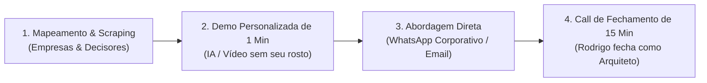

# 🎯 Estratégia de Vendas: Outbound Cirúrgico com Demo de 1 Minuto

> **Responsáveis**: Ricardo Monteiro (Diretor Comercial) & Jordan Belford (Especialista em Fechamento)  
> **Operador**: Rodrigo Bettio Jr.  
> **Status**: Em Estruturação  

---

## 1. A Tese do "Cavalo de Troia Inovador"
- **Gancho de Curiosidade (O Choque de Inovação)**: Vídeo ou demonstração de 40 a 60 segundos com IA (atendente inteligente em voz ou avatar contextualizado) mostrando um problema real que o cliente tem no negócio dele.
- **A Entrega Sólida (O que gera faturamento recorrente)**:
  - Organização do funil de WhatsApp / CRM.
  - Automações de atendimento para não perder leads fora do horário comercial.
  - Manutenção em nuvem e suporte técnico.

---

## 2. O Funil de 4 Etapas

---

## 3. Próximos Passos Comerciais
- [ ] Definir os 2 nichos prioritários para o primeiro lote de 30 empresas (ex: Clínicas odontológicas/estética vs. Imobiliárias vs. Escritórios).
- [ ] Redigir os scripts de abordagem com Ricardo Monteiro e Jordan Belford.
- [ ] Gravar/Gerar o primeiro modelo de Demo de 1 Minuto.
