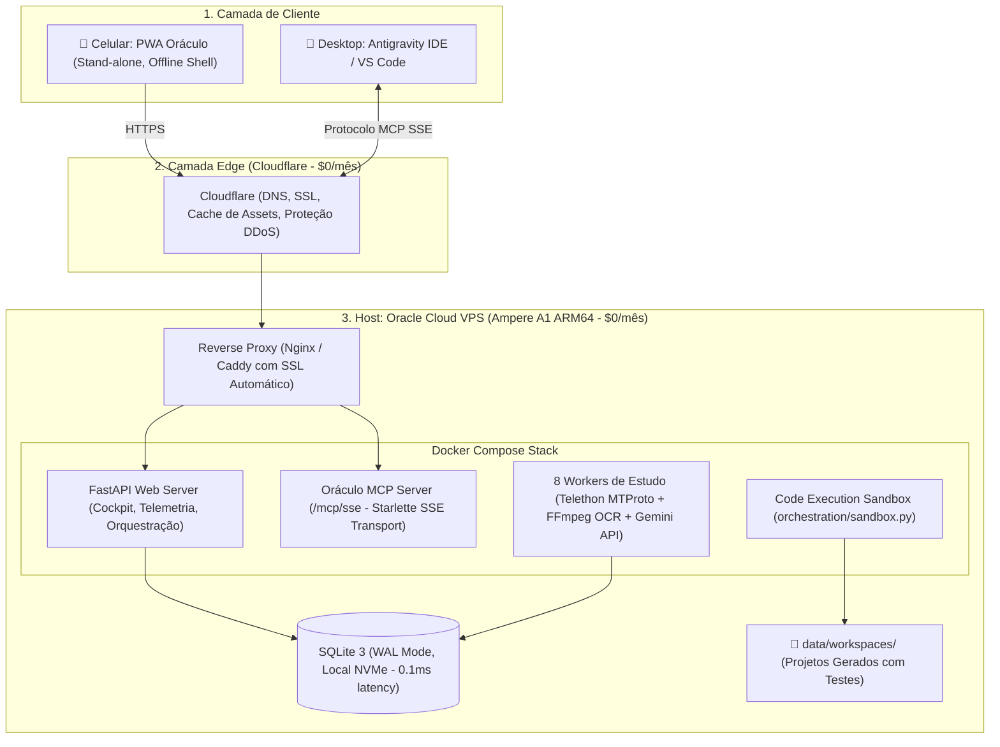

# 🏛️ Arquitetura do Sistema Oráculo & Agentes Autônomos
> **Documento Oficial de Arquitetura — Mantido por Alex Vance (⚡) e Bruno (🤖)**

---

## 1. Visão Geral da Topologia
O sistema Oráculo opera como um **Monolito Modular de Alta Eficiência** containerizado com Docker, balanceando processamento contínuo em segundo plano e serviços de borda com custo zero ou mínimo.

---

## 2. Decisões Arquiteturais Fundamentais (ADR)

### ADR-01: SQLite WAL Mode em vez de Banco em Nuvem Distribuído
- **Decisão**: Usar SQLite 3 no modo WAL (`PRAGMA journal_mode=WAL;`).
- **Motivo**: O Oráculo é um sistema de alta concorrência de leitura e escrita sequencial rápida. O SQLite local em disco NVMe tem latência de microssegundos (< 1ms), elimina custos de banco de dados gerenciado (ex: Aurora Serverless $45/mês) e simplifica o backup para um único arquivo.

### ADR-02: Oracle Cloud Always Free (ARM64 Ampere A1) em vez de AWS Serverless
- **Decisão**: Hospedar o backend e workers na instância gratuita permanente da Oracle Cloud (4 OCPU, 24GB RAM, 200GB SSD).
- **Motivo**: O workload do Oráculo envolve sockets TCP persistentes (Telegram MTProto), processamento contínuo de vídeo (FFmpeg) e conexões streaming (MCP SSE). Em funções Serverless (AWS Lambda), esses padrões enfrentam timeouts rígidos e faturas astronômicas de GB-segundos e NAT Gateways. Na Oracle Free, o custo fixo é **$0.00/mês**.

### ADR-03: Oráculo como MCP Server (Model Context Protocol)
- **Decisão**: Expor o acervo de conhecimento dos agentes através do endpoint padrão `/mcp/sse`.
- **Motivo**: Permite que qualquer IDE compatível com MCP (Antigravity, Cursor, Claude Code, VS Code) acesse a inteligência e os cursos do Oráculo remotamente sem acoplamento de código.

---

## 3. Padrão de Engenharia de Software: SDD + TDD
Todo novo módulo ou projeto gerado no Oráculo obedece obrigatoriamente a:
1. **Spec First (`docs/spec.md`)**: A especificação é o contrato antes de qualquer código.
2. **Test First (`tests/test_*.py`)**: A suíte de testes unitários é criada com base na especificação.
3. **Sandbox Execution (`orchestration/sandbox.py`)**: O código é validado no subprocesso e só é promovido se 100% dos testes passarem.
