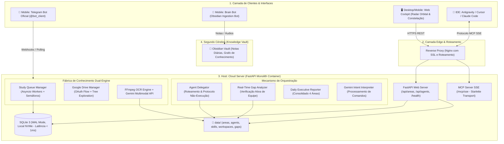

# 🏛️ Arquitetura do Sistema Oráculo & Agentes Autônomos
> **Documento Oficial de Arquitetura — Mantido por Alex Vance (⚡ Arquiteto-Chefe) & Tiago Tech (💻 VP de TI)**  
> **Padrão de Referência**: Architecture Decision Records (ADR) + Spec-Driven Development (SDD)

---

## 1. Visão Geral da Topologia do Sistema

O sistema Oráculo opera como um **Monolito Modular de Alta Eficiência** containerizado com Docker, balanceando processamento contínuo em segundo plano (24/7) e serviços de borda com telemetria mobile e interface de alta densidade informativa.

```mermaid
flowchart TD
    subgraph ClientLayer ["1. Camada de Clientes & Interfaces"]
        TGBot["📱 Mobile: Telegram Bot Oficial (@bot_client)"]
        TGBrain["🧠 Mobile: Brain Bot (Obsidian Ingestion Bot)"]
        WebCockpit["🖥️ Desktop/Mobile: Web Cockpit (Radar Orbital & Constelação)"]
        AGY["🧬 IDE: Antigravity / Cursor / Claude Code"]
    end

    subgraph EdgeLayer ["2. Camada Edge & Roteamento"]
        Proxy["Reverse Proxy (Nginx com SSL e Roteamento)"]
    end

    subgraph CoreBackend ["3. Host: Cloud Server (FastAPI Monolith Container)"]
        API["FastAPI Web Server (/api/areas, /api/agents, /health)"]
        MCP["MCP Server SSE (/mcp/sse - Starlette Transport)"]
        
        subgraph OrchestrationEngine ["Mecanismo de Orquestração"]
            Delegator["Agent Delegator (Roteamento & Protocolo Não-Execução)"]
            GapAnalyzer["Real-Time Gap Analyzer (Verificação Ativa de Equipe)"]
            DailyReporter["Daily Executive Reporter (Consolidado 4 Áreas)"]
            IntentInterpreter["Gemini Intent Interpreter (Processamento de Comandos)"]
        end

        subgraph IngestionWorkers ["Fábrica de Conhecimento Dual-Engine"]
            QueueMgr["Study Queue Manager (Asyncio Workers + Semáforos)"]
            DriveClient["Google Drive Manager (OAuth Flow + Tree Exploration)"]
            VideoProcessor["FFmpeg OCR Engine + Gemini Multimodal API"]
        end
        
        SQLite[("SQLite 3 (WAL Mode, Local NVMe - Latência < 1ms)")]
        DiskStorage["📁 data/ (areas, agents, skills, workspaces, gaps)"]
    end

    subgraph KnowledgeVault ["4. Segundo Cérebro (Knowledge Vault)"]
        Obsidian["📓 Obsidian Vault (Notas Diárias, Grafo de Conhecimento)"]
    end

    TGBot -->|Webhooks / Polling| IngestionWorkers
    TGBrain -->|Notas / Áudios| Obsidian
    WebCockpit -->|HTTPS REST| Proxy
    AGY <-->|Protocolo MCP SSE| Proxy
    Proxy --> API
    Proxy --> MCP
    API --> SQLite
    API --> DiskStorage
    QueueMgr --> SQLite
    VideoProcessor --> DiskStorage
    Delegator --> DiskStorage
    GapAnalyzer --> DiskStorage
```

---

## 2. Decisões Arquiteturais Fundamentais (ADRs)

Este catálogo documenta todas as decisões arquiteturais fundamentais que norteiam o projeto atual e servem de padrão obrigatório para todos os projetos subsequentes.

---

### ADR-01: SQLite WAL Mode em vez de Banco em Nuvem Distribuído
- **Status**: Aprovado e Ativo
- **Requisitos Vinculados**: [RF01, RF02, RNF01]
- **Contexto**: O sistema realiza gravações e leituras de alta frequência durante o enfileiramento e acompanhamento de estudos dezenas de vezes por minuto.
- **Decisão**: Adotar SQLite 3 configurado no modo Write-Ahead Logging (`PRAGMA journal_mode=WAL;`) armazenado localmente em `data/oraculo.db`.
- **Consequências Positivas**:
  - Latência de leitura/escrita inferior a 1 milissegundo (< 1ms).
  - Custo zero de banco de dados gerenciado em nuvem (elimina RDS/Cloud SQL custando $40-$100/mês).
  - Facilidade de backup através de um único arquivo consistente.
  - Concorrência de múltiplos leitores simultâneos sem bloqueio do processo gravador.
- **Consequências Negativas / Mitigações**:
  - Requer um lock local de concorrência (`threading.Lock` / `asyncio.Lock`) para escritas; implementado de forma transparente em `StudyQueueManager`.

---

### ADR-02: Cloud Host Econômico / Free Tier em vez de AWS Serverless
- **Status**: Aprovado e Ativo
- **Requisitos Vinculados**: [RNF02, RF01, RF02]
- **Contexto**: O Oráculo executa downloads de arquivos de mídia de até 2GB, processamento demorado de vídeo via FFmpeg e conexões persistentes via Telegram MTProto.
- **Decisão**: Executar o monolito em um servidor permanente (GCP / Oracle Cloud Always Free Ampere A1) com Docker Compose, em vez de arquitetura Serverless baseada em lambdas.
- **Consequências Positivas**:
  - Elimina timeouts rígidos típicos de Lambdas (15 minutos).
  - Custo fixo previsível de $0.00 a valores mínimos de VM de borda.
  - Sockets TCP persistentes sem custos exorbitantes de NAT Gateway.
- **Consequências Negativas**:
  - Exige monitoramento do container e script de auto-deploy (`scripts/auto_deploy.sh`).

---

### ADR-03: Oráculo como MCP Server (Model Context Protocol)
- **Status**: Aprovado e Ativo
- **Requisitos Vinculados**: [RF12]
- **Contexto**: Desenvolvedores e agentes na Antigravity IDE, Cursor e Claude Code precisam consultar as skills ricas e as aulas estudadas sem acoplamento de código.
- **Decisão**: Expor o endpoint padronizado `/mcp/sse` implementando o Model Context Protocol.
- **Consequências Positivas**:
  - Qualquer ferramenta de inteligência artificial de mercado consegue consultar ferramentas e recursos do Oráculo de forma nativa e desacoplada.
  - Conexão bidirecional via Server-Sent Events (SSE).

---

### ADR-04: Modelo de Interação Telegram Exclusivo via Bot Client
- **Status**: Aprovado e Ativo (Refatoração Outubro/2026)
- **Requisitos Vinculados**: [RF04, RNF06]
- **Contexto**: A integração anterior registrava listeners de mensagens na sessão de usuário pessoal (`user_client`), resultando na interceptação indevida de chats pessoais, grupos privados e Mensagens Salvas do operador.
- **Decisão**:
  1. A sessão de usuário (`user_client`) opera estritamente em modo passivo (usada apenas para download de mídias quando necessário); **nenhum** listener de `NewMessage` é registrado sobre ela.
  2. O sistema de mensageria mobile opera com exclusividade através da sessão do Bot oficial (`bot_client`).
  3. No privado com o Bot, suporte a menus táticos, comandos e diálogo livre com o ecossistema.
  4. Em grupos comunitários, o bot **só** responde a comandos diretos (`/...`), menções (@) ou tópicos previamente vinculados. Conversas cotidianas de terceiros são 100% ignoradas.
- **Consequências Positivas**:
  - Privacidade 100% preservada para a conta pessoal do operador.
  - Eliminação de respostas indesejadas em grupos de amigos, família ou trabalho alheios ao Oráculo.

---

### ADR-05: Avaliação Dinâmica de Skill GAPs em Tempo Real
- **Status**: Aprovado e Ativo (Refatoração Outubro/2026)
- **Requisitos Vinculados**: [RF07, RF08]
- **Contexto**: GAPs de competência eram armazenados em arquivos estáticos em disco (`tech_gap_analysis.json`). Mesmo após a contratação de especialistas como Cláudio Cloud (Cloud/SRE) e Quinn QA (QA/TDD), os relatórios matinais continuavam exibindo essas áreas como críticas por leitura de cache desatualizado.
- **Decisão**:
  1. O método `analyze_manager_skill_gaps` avalia dinamicamente e em tempo real o catálogo de especialistas atualmente ativos na área.
  2. Implementação da função `is_competency_covered`: se houver especialista ativo cobrindo os domínios mapeados (QA, Cloud, N8N, Tráfego, etc.), o gap e sua respectiva recomendação de contratação são automaticamente saneados.
  3. Caches estáticos são isolados em `data/gaps/` e validados antes de qualquer leitura.
- **Consequências Positivas**:
  - Relatórios executivos refletem a realidade imediata da empresa.
  - Eliminação de alarmes falsos de carências que já foram supridas pela liderança.

---

### ADR-06: Governança Quad-Departamental e Protocolo de Não-Execução de Gestores
- **Status**: Aprovado e Ativo (Refatoração Outubro/2026)
- **Requisitos Vinculados**: [RF06, RF16]
- **Contexto**: A área de Marketing operava sem gestor próprio dedicado, gerando confusão hierárquica e atribuindo demandas de tráfego ao gestor de vendas.
- **Decisão**:
  1. Estabelecer formalmente os 4 departamentos executivos do Oráculo:
     - **Tecnologia & Desenvolvimento**: Tiago Tech (`gestor_tech_cto`)
     - **Marketing & Growth**: Marcelo Marketing (`gestor_marketing`)
     - **Vendas & Negociação**: Victor Vendas (`gestor_sales_director`)
     - **Mente, Foco & Performance**: Marina Mente (`gestor_mind_wellness`)
  2. Implementar o **Protocolo de Não-Execução**: Gestores nunca executam tarefas manuais. Quando consultados sobre código, campanhas ou prospecção, eles avaliam estrategicamente, consultam seu especialista e entregam uma síntese executiva de negócio.
- **Consequências Positivas**:
  - Especialização clara de papéis e responsabilidades.
  - Marketing autônomo coordenando tráfego pago (Sobral), branding (Diamand) e conteúdo (Ana).

---

### ADR-07: Dual-Engine Study Queue e Sanitização de Metadados de Áreas
- **Status**: Aprovado e Ativo (Refatoração Outubro/2026)
- **Requisitos Vinculados**: [RF01, RF10]
- **Contexto**: A varredura de arquivos no diretório `data/areas/` lia indistintamente arquivos de análise de gaps (`*_gap_analysis.json`), gerando áreas fantasmas no Radar Orbital com identificadores nulos.
- **Decisão**:
  1. Isolar todos os arquivos de diagnóstico de gaps em `data/gaps/`.
  2. Na função `load_all_areas()` de `web/app.py` e `manager_sync.py`, aplicar filtro estrito ignorando qualquer arquivo não conforme ou que não possua atributos `id` e `name` válidos.
  3. Disponibilizar CRUD completo no frontend com botões rápidos de criação, edição e exclusão.
- **Consequências Positivas**:
  - Radar Orbital limpo, exibindo exclusivamente os 4 domínios oficiais.
  - Zero ocorrência de nós fantasmas ou cartões em branco.

---

### ADR-08: Segundo Cérebro Assíncrono com Vault Obsidian
- **Status**: Aprovado e Ativo
- **Requisitos Vinculados**: [RF13]
- **Contexto**: O fundador necessita capturar pensamentos, links de artigos e notas de voz de forma imediata via celular sem fricção de abertura de IDE.
- **Decisão**: Integrar um daemon secundário (`ingestion/brain_bot.py`) associado a um bot específico de captura que converte áudio em texto via Gemini e escreve diretamente no Vault Obsidian em Markdown com metadados YAML.
- **Consequências Positivas**:
  - Registro de insights em menos de 5 segundos.
  - Criação de links bidirecionais automáticos (`[[Conceito]]`) integrados ao grafo do Obsidian.

---

## 3. Padrão de Engenharia para Novos Projetos (Checklist Obrigatório)

Para todos os projetos subsequentes criados dentro do ecossistema, o seguinte ciclo de vida deve ser rigorosamente seguido:

1. **Spec First (`docs/spec.md`)**:
   - Definição clara da visão, matriz de governança, lista formal de RFs (RF01..RFn) e RNFs.
2. **ADR Documentation (`docs/architecture.md`)**:
   - Toda escolha técnica de banco, arquitetura, framework ou segurança deve ser justificada como um ADR enumerado e vinculado aos RFs.
3. **TDD Protocol (Test-Driven Development)**:
   - Nenhuma funcionalidade é considerada entregue sem sua suíte de testes unitários em `tests/` com cobertura determinística.
4. **Clean Code & Non-Execution Principle**:
   - Separação estrita de camadas (Entidades, Casos de Uso, Adaptadores e Interfaces).
   - Gestores orquestram; especialistas executam.
