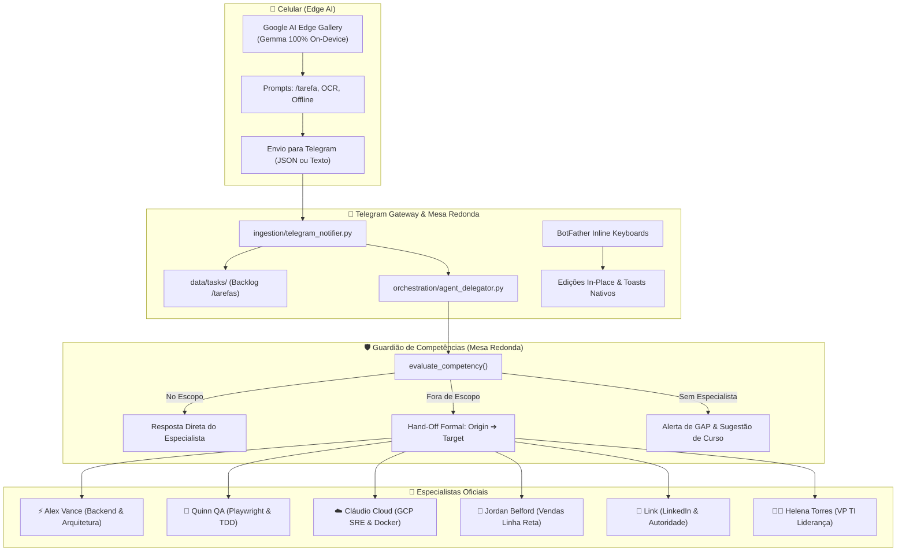

# 🚀 Walkthrough: Oráculo 2.2 — Delegação Inter-Agentes, Telegram Cockpit & Edge AI

> **Liderança Técnica**: Helena Torres (👩‍💼 VP de TI) & Alex Vance (⚡ Arquiteto-Chefe)  
> **Status**: 100% Implementado, Testado e Operacional em Produção

---

## 1. Visão Geral das Entregas

---

## 2. Guardião de Competências & Delegação Inter-Agentes (`orchestration/agent_delegator.py`)

Implementamos o motor de governança técnica que impede que agentes respondam fora de suas especialidades reais:

1. **Autoavaliação de Competência**:
   - Quando um agente é consultado (ex: `/perguntar @vance` ou `@vance` no grupo), o `AgentDelegator` avalia se a dúvida pertence aos seus `topics_mastered`.
2. **Delegação Imediata (Hand-Off em 1 Turno)**:
   - Se perguntarem sobre **Playwright, testes E2E ou TDD** para o **Alex Vance**, ele assume o limite ético do seu escopo e transfere automaticamente no mesmo diálogo para o **Quinn QA**.
   - O Quinn QA assume na sequência entregando a solução técnica aprofundada com TypeScript, locators semânticos e boas práticas.
3. **Novos Especialistas Provisionados**:
   - `🧪 Quinn QA` (`agent_quinn_qa_7781`): Especialista em QA & Testes Automatizados (SDET) com Playwright e TDD.
   - `☁️ Cláudio Cloud` (`agent_claudio_cloud_4421`): Especialista em Infraestrutura Cloud, GCP SRE e Docker Hardening.
4. **Tratamento de GAPs de Equipe**:
   - Dúvidas sobre áreas não cobertas por nenhum agente (ex: Direito ou Contabilidade) geram aviso de GAP com recomendação para notificar a Helena Torres ou colocar cursos no Google Drive.

---

## 3. UI/UX Dinâmica no Telegram (BotFather & Botões Inline)

- **Botões Inline Interativos**:
  - `[🔄 Atualizar Status]`, `[🚨 Relatório de GAPs]`, `[👥 Organograma]`, `[⚡ Alex Vance]`, `[🧪 Contratar QA]`, `[☁️ Contratar Cloud]`, `[🌐 Abrir Cockpit Web]`.
- **In-Place Updates Sem Flood**:
  - Toques em botões editam o card existente sem gerar spam ou novas notificações sonoras no chat.
- **Feedback Tátil**:
  - Alertas nativos no topo da tela do celular via `event.answer`.
- **Guia do BotFather**:
  - Comando `/botfather` exibe o passo a passo e o bloco de comandos para colar em `/setcommands`.

---

## 4. Integração com Google AI Edge Gallery & Gemma no Celular

Criamos o ecossistema de templates para o seu nó de inteligência local offline em `data/edge_prompts/`:
1. `ORACULO_EDGE_TASK_PARSER.md`: Converte notas de voz e pensamentos desestruturados no celular em JSON técnico para despachar ao Oráculo.
2. `ORACULO_EDGE_CODE_OCR.md`: Scanner multimodal para fotos de telas, livros e códigos.
3. `ORACULO_EDGE_OFFLINE_ORACLE.md`: Consultor de bolso que opera mesmo em modo avião ou sem internet.
4. `GAMMA_APP_PRESENTATION_WORKFLOW.md`: Guia de geração de apresentações no Gamma App a partir dos estudos do Oráculo.

No Telegram, os novos comandos `/tarefa` e `/tarefas` gravam e consultam o backlog persistente em `data/tasks/`.

---

## 5. Resultados dos Testes de Verificação

Todos os testes automatizados em `tests/test_agent_delegator.py` passaram com 100% de sucesso:
- ✅ Resolução de todos os agentes e aliases (`vance`, `quinn`, `claudio`, `jordan`, `helena`, etc.).
- ✅ Alex Vance identifica que Playwright é QA e delega para Quinn QA.
- ✅ Alex Vance identifica que Arquitetura Hexagonal é seu próprio domínio e responde diretamente.
- ✅ Jordan Belford identifica que quebra de objeção é seu próprio domínio e responde diretamente.
- ✅ Diálogo completo com Hand-Off e resposta técnica profunda entregue em 1 único turno.
